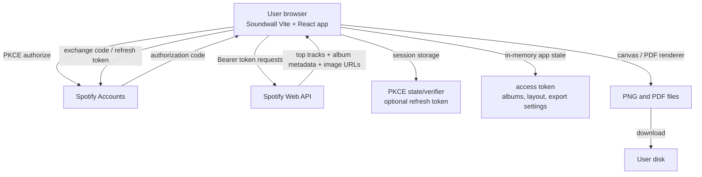

# Soundwall Research Report

## Executive summary

Soundwall is best built as a **local-first, browser-only Vite + React + TypeScript app** that the user runs on their own machine and connects to **their own Spotify developer app** using **Authorization Code with PKCE**. That architecture matches Spotify’s guidance for apps that cannot safely store a client secret, avoids hosting costs, keeps user data off any Soundwall server, and fits the project’s open-source goal. It also aligns with Spotify’s current development-mode constraints: the app owner must have Spotify Premium, development-mode apps are limited to one client ID and up to five authorized users, and development mode is explicitly positioned for personal projects and experimentation rather than as a base for scaling a business. For Soundwall, that makes “bring your own Client ID” the right default, not a shared public client. citeturn22search3turn16search1turn17view0turn9search0turn24view0

For **V1**, the product should do one thing well: fetch the user’s Spotify **top tracks**, infer likely **top albums**, optionally enforce **one album per artist**, and render a **cover-only collage** that exports to **PNG** and **print-sized PDF**. Spotify’s API exposes top **tracks** and **artists**, not top albums, so album ranking must be inferred. The cleanest method is to pull `/me/top/tracks` across `short_term`, `medium_term`, and `long_term`, paginate because the endpoint caps each request at 50 items, group tracks by `album.id`, score albums by track rank across time ranges, then apply an artist-deduping toggle. This is straightforward, deterministic, and requires only a handful of API calls. citeturn0search2turn11search1turn15search0

The main technical risk is **exporting remote album art**. Browsers taint a canvas if cross-origin images are drawn without proper CORS approval, which blocks `toBlob()`/`toDataURL()` export. Soundwall therefore needs a robust image-loading pipeline with `crossOrigin="anonymous"`, an early export self-test, and a graceful failure mode if Spotify image responses do not include export-safe CORS headers in a given environment. Because the collage is simple grid art, Soundwall should **not** depend on DOM screenshot tooling as its primary export engine; a direct **scene-graph → canvas** renderer is simpler, faster, and more predictable. citeturn5search0turn5search1turn6search0turn6search1

The largest non-technical constraint is **licensing and platform policy**. Spotify’s policy requires attribution with Spotify branding, requires metadata and cover art to link back to Spotify, prohibits offering cover art as a standalone service or product, and requires Spotify visual content to remain in its original form without overlays, distortion, or cropping. That makes an open-source personal-use collage generator much more defensible than a print-store business built around album-cover exports. citeturn2search0turn2search2turn1search3

A realistic V1 is a **five-to-seven week build** for one experienced developer, roughly **90 to 125 hours**, including tests, documentation, export polish, and accessibility. V2 should add manual album search/swap and drag-and-drop ordering; V3 can add streaming-history import, a hosted option gated by Spotify realities, and any commerce exploration. citeturn15search0turn16search3turn4search1

## Product constraints and technical architecture

Soundwall’s feasibility is shaped as much by Spotify’s current platform rules as by front-end engineering. New apps start in **development mode**. Spotify’s quota documentation states that development-mode apps are meant for apps under construction or single-account use, that the app owner must have Spotify Premium, and that up to five authenticated users can use a development-mode app. Spotify’s February 2026 update similarly says development mode now requires Premium, limits developers to one development client ID, limits each client ID to five authorized users, and should not be relied on as the basis for scaling a business. Those rules strongly favor an **open-source local app where each user registers their own Spotify app**. citeturn16search1turn17view0

That leads to a simple architecture: Soundwall runs entirely in the browser; it talks directly to **Spotify Accounts** for OAuth and directly to the **Spotify Web API** for data; it stores only ephemeral auth and local UI state; and it downloads exported files directly to the user’s disk. No Soundwall backend is required. Spotify explicitly recommends PKCE for single-page and browser-based apps where a client secret cannot be safely stored. Vite is a good fit because it scaffolds React + TypeScript quickly, runs a local dev server, and exposes environment variables through `import.meta.env`, while warning that any `VITE_*` variable is bundled client-side and therefore must not be treated as secret. citeturn22search3turn11search2turn9search0turn24view0



The resulting architectural principles are clear. First, **BYO Client ID** is not just a convenience; it is the only durable way for an open-source project to avoid the five-user ceiling on any one shared development-mode client. Second, Soundwall should avoid unnecessary Spotify calls, especially because Spotify rate-limits apps in a rolling 30-second window and returns `429` when the app exceeds its limit. Third, because Spotify’s February 2026 migration removed several batch fetch endpoints for development-mode apps, Soundwall should be designed so that the **top tracks responses themselves provide most of the album metadata it needs**, minimizing any dependence on additional album lookups. citeturn16search1turn17view0turn2search3turn15search0

## Spotify integration and PKCE

Spotify’s current **Authorization Code with PKCE** flow is the correct auth path for Soundwall. Spotify’s PKCE tutorial specifies the core steps: create a high-entropy `code_verifier`, hash it with SHA-256 to create the `code_challenge`, redirect the user to `/authorize`, receive the authorization code on the registered redirect URI, then exchange that code at `/api/token` using the original `code_verifier`. Spotify also strongly recommends a `state` parameter for CSRF protection, and requires the `redirect_uri` used during code exchange to exactly match the one used during authorization. citeturn22search3turn11search2

For local development, redirect URI handling matters. Spotify’s redirect-URI rules now require **HTTPS** for non-loopback redirects, but allow **HTTP** for explicit loopback IP literals such as `127.0.0.1` or `[::1]`. Spotify explicitly disallows `localhost` and says loopback IP literals may use dynamic ports. In practice, Soundwall should document one fixed redirect, such as `http://127.0.0.1:5173/callback`, because it is easier for non-technical users to register once and reuse. citeturn1search1turn1search0

For V1, Soundwall only needs one Spotify scope: **`user-top-read`**, which grants access to the current user’s top artists and tracks and is the scope required by **Get User’s Top Items**. Soundwall does **not** need playback, email, private profile, or library scopes for its first release. Keeping scope surface area minimal reduces friction and improves trust. citeturn11search1turn0search2

The Spotify endpoints Soundwall should use in V1 are summarized below.

| Endpoint | Purpose in Soundwall | Scope | Notes |
|---|---|---|---|
| `GET https://accounts.spotify.com/authorize` | Start PKCE consent flow | none directly; scopes requested in query | PKCE `code_challenge` + `state` required/recommended |
| `POST https://accounts.spotify.com/api/token` | Exchange code for access token; refresh token later | none beyond valid app/user auth context | For PKCE, send `client_id`, `code_verifier`, `grant_type` |
| `GET /v1/me/top/tracks` | Fetch ranked track affinities | `user-top-read` | `short_term`, `medium_term`, `long_term`; `limit` max 50; can paginate with `offset` |
| `GET /v1/albums/{id}` | Optional fallback if canonical album data is missing | access token only | Prefer to avoid unless actually needed |
| `GET /v1/search` | Future manual search/swap feature | access token only | In new dev mode, `limit` max is 10 per request |

The data collection strategy for V1 should be:

- Request `short_term`, `medium_term`, and `long_term`.
- For each time range, request **two pages** of top tracks: `offset=0, limit=50` and `offset=50, limit=50`.
- Normalize the results into a shared local structure.
- Stop there. Do not fetch recently played tracks in V1.

That last choice matters because **Recently Played** is capped at 50 items per request and is not an actual lifetime or affinity ranking. It is useful for recency products, not for Soundwall’s “taste summary” poster. If Soundwall later wants true lifetime album ranking, the correct next step is a user-imported **Extended Streaming History** file; Spotify’s own data export documentation says that file includes lifetime stream events, `msPlayed`, artist name, album name, and track URI. citeturn0search2turn3search0turn4search1

The recommended local auth-storage model is conservative. Store the **access token in memory**, so a full page reload can discard it cleanly. Store **`state`** and **`code_verifier`** in **`sessionStorage`**, because the data survives reloads but is scoped to the current tab and cleared when the tab session ends. If Soundwall wants refresh-based reauthentication later, it can store the refresh token in session storage too, but that should be an explicit product decision because any browser storage accessible to page scripts increases exposure relative to memory-only handling. MDN’s storage docs make the persistence difference clear: `localStorage` persists across browser sessions, while `sessionStorage` is page-session scoped. Spotify’s refresh-token tutorial confirms refresh tokens can be used to obtain new access tokens without reauthorizing the user, and that PKCE refreshes require the `client_id`. citeturn22search0turn21search0turn4search0

## Album inference and collage algorithms

Spotify does **not** expose a “top albums” endpoint. The official top-items endpoint only returns top **artists** or **tracks**. That means Soundwall’s ranking layer is fundamentally an approximation engine over a track-affinity API. The right design choice is not to hide that fact, but to make the approximation stable, explainable, and good enough for a poster. citeturn0search2

The cleanest V1 normalization schema is:

```ts
type RankedTrack = {
  trackId: string;
  trackName: string;
  albumId: string;
  albumName: string;
  albumUrl: string;
  albumImageUrl: string | null;
  primaryArtistId: string;
  primaryArtistName: string;
  rank: number;          // 1..100 within a time range
  timeRange: "short_term" | "medium_term" | "long_term";
};
```

The album inference algorithm should then follow four passes.

### Normalize and deduplicate

From each top-track response, extract the album ID, album name, Spotify album URL, primary artist, and best available image URL. Spotify album objects include an `images` array ordered widest-first, which is useful for selecting the highest-resolution image that is already present in the payload or in any optional album fallback response. Because batch album fetch endpoints were removed for development-mode migrations, Soundwall should prefer metadata already included in the top-track payload and avoid extra fetches unless a field is genuinely missing. citeturn11search0turn15search0

### Score tracks into albums

A simple, strong default formula is:

\[
\text{rankPoints} = (\text{maxRank} + 1 - \text{rank})
\]

with `maxRank = 100`, and

\[
\text{albumScore} = \sum(\text{rankPoints} \times \text{timeRangeWeight}) + \text{persistenceBonus}
\]

Recommended default weights:

- `short_term = 1.00`
- `medium_term = 1.15`
- `long_term = 1.30`

Recommended persistence bonus:

- add `+12` for each additional time range in which the album appears beyond the first.

This weighting is not mandated by Spotify; it is a Soundwall design choice. The rationale is that long-term affinity is a stronger signal for a wall poster than a four-week spike, while cross-range persistence should be rewarded without overwhelming rank itself. Since Spotify’s endpoint already returns separately computed affinities for ~4 weeks, ~6 months, and ~1 year, this formula uses Spotify’s structure rather than inventing unsupported play-count estimates. citeturn0search2

### Apply one-album-per-artist when enabled

The **one-album-per-artist toggle** should be implemented after album scoring, not during it. That keeps rankings explainable.

Algorithm:

1. Rank all albums by `albumScore`.
2. If the toggle is **off**, return the sorted list directly.
3. If the toggle is **on**, iterate albums in score order and keep only the first album whose `primaryArtistId` has not yet been selected.
4. Continue until the requested collage size is filled.

Tie-breakers should be deterministic:

1. higher `albumScore`
2. more distinct time ranges present
3. higher best single-track score
4. lexical sort on `albumId`

This toggle is computationally trivial, but it dramatically improves visual variety for larger grids, where otherwise a few artists may dominate. It also matches the stated product idea without destroying the underlying raw ranking layer.

### Derive grid order

Soundwall should support two V1 ordering modes:

- **Ranked**, which places albums in descending score order.
- **Shuffled**, which pseudo-randomizes from the ranked set with a reproducible seeded shuffle.

A seeded shuffle is better than `Math.random()` because it enables consistent re-export of the same composition unless the user explicitly reshuffles. The seed can live entirely in UI state.

## Rendering and export pipeline

Soundwall’s collage is a remarkably good match for direct browser rendering because the output is mostly **square images, fixed gaps, and a solid background**. That means the app should use an internal **scene graph** and render directly to an export surface instead of treating the DOM as the source of truth. The DOM can still be used for preview, but export should be generated from structured layout data, not from a screenshot of whatever happens to be on screen. MDN’s canvas docs cover the primitives Soundwall needs: `drawImage()` for placing album art and `toBlob()` for producing a downloadable PNG. citeturn6search1turn6search0

### Recommended scene graph

```ts
type CollageScene = {
  width: number;
  height: number;
  background: string;
  gap: number;
  rows: number;
  cols: number;
  items: Array<{
    albumId: string;
    imageUrl: string;
    x: number;
    y: number;
    size: number;
  }>;
};
```

A single pure function should take albums plus layout settings and return this scene. Both preview and export then consume the same scene, which reduces drift between what the user sees and what gets downloaded.

### Preview strategy

For the interactive preview, there are two good options:

- **CSS Grid + `` tags** for easiest development.
- **SVG `<image>` elements** for tighter parity with the export scene.

For V1, CSS Grid is easier for interaction and responsiveness. Export should still bypass DOM capture and redraw from scene state. That is preferable because `<foreignObject>`-based SVG/DOM export and screenshot libraries add complexity without adding much value for a simple cover grid. MDN documents `<foreignObject>`, but Soundwall does not need it for its initial output class. citeturn5search4turn6search1

### CORS and image-export workarounds

This is Soundwall’s most important implementation caveat. MDN’s canvas security guidance is explicit: if you draw a cross-origin image without appropriate CORS approval, the canvas becomes **tainted**, and attempting to read or export it throws an exception. The browser-side mitigation is to set `img.crossOrigin = "anonymous"` before loading the image and rely on the remote server to return the right CORS headers. If those headers are absent, no front-end-only trick can make that image export-safe. citeturn5search0turn5search1

The practical export plan should therefore be:

1. Load every album image through a shared loader that sets `crossOrigin = "anonymous"`.
2. Wait for all images to settle.
3. Run a tiny hidden-canvas export test with one image.
4. If export works, continue with normal export.
5. If export fails, show a clear message: preview is available, but image export is blocked by cross-origin policy in the current environment.

A few important conclusions follow. First, **DOM screenshot libraries are not a real workaround** for tainted source images; the browser security model still applies. Second, any fallback that fetches image bytes in the browser still requires CORS. Third, a server-side image proxy would solve the problem but violates the “fully local, no server” requirement. So Soundwall should be architected to detect the problem early and fail gracefully, not to promise impossible client-only workarounds. citeturn5search0turn5search1turn6search0

### PNG export

PNG export should use an **offscreen canvas** sized to the exact target pixel dimensions. After drawing all covers and the background, call `canvas.toBlob("image/png")` and download the resulting blob. MDN notes that `toBlob()` exports at **96 dpi metadata** where the format supports resolution metadata, so print quality should be managed through large pixel dimensions, not by expecting browser PNG metadata to declare 300 ppi. citeturn6search0

### Print-ready PDF export

For posters, the safest front-end path is to generate a **high-pixel PNG first**, then embed that image into a PDF whose page size matches the desired physical dimensions. jsPDF supports page units such as inches and lets you add an image at explicit page coordinates; pdf-lib supports embedding PNG bytes in the browser as well. For Soundwall, jsPDF is slightly simpler for page-size ergonomics, while pdf-lib is stronger if future versions need more advanced PDF control. Either library is workable. citeturn18search0turn7search1turn7search5

Adobe’s print guidance still treats **300 ppi** as the standard target for high-quality prints viewed up close. Using that baseline, Soundwall should compute poster raster sizes as:

\[
\text{pixels} = \text{inches} \times 300
\]

and then place that raster full-page into an equivalently sized PDF page. citeturn10search3turn18search0

The export presets below are the right V1 defaults. Poster pixel sizes are calculated from 300 ppi; screen presets are recommended targets, not claims about any single current device model. For screen exports, Soundwall should preview at CSS size and export at actual target pixels or about **2×** the CSS preview width using `devicePixelRatio`-aware logic when appropriate. citeturn10search3turn10search4turn18search0

| Preset | Use case | Aspect ratio | Physical size | Target pixels | DPI / PPI |
|---|---|---:|---:|---:|---:|
| Square social | Square wallpaper / post | 1:1 | — | 3000 × 3000 | screen |
| Phone portrait | Home / lock screen | 9:19.5-ish | — | 1290 × 2796 | screen |
| Tall phone universal | Android-style portrait | 9:20 | — | 1440 × 3200 | screen |
| Tablet portrait | Tablet wallpaper | 3:4 | — | 2048 × 2732 | screen |
| Desktop HD | Desktop wallpaper | 16:9 | — | 1920 × 1080 | screen |
| Desktop 4K | High-res desktop wallpaper | 16:9 | — | 3840 × 2160 | screen |
| Small poster | Print | 11 × 17 in | 11 × 17 in | 3300 × 5100 | 300 ppi |
| Standard poster | Print | 18 × 24 in | 18 × 24 in | 5400 × 7200 | 300 ppi |
| Large poster | Print | 24 × 36 in | 24 × 36 in | 7200 × 10800 | 300 ppi |

## Implementation plan and repository design

The fastest path is to scaffold a **Vite React TypeScript** app, then build from the inside out: auth first, data layer second, ranking third, rendering/export fourth, polish last. Vite’s official guide supports the `react-ts` template and documents the local scripts for development, build, and preview. citeturn9search0

A good repository shape for V1 is:

```text
soundwall/
  .github/
    workflows/
      ci.yml
  public/
  src/
    app/
      App.tsx
      routes.tsx
    auth/
      pkce.ts
      spotifyAuth.ts
      tokenStore.ts
    spotify/
      api.ts
      endpoints.ts
      types.ts
      topTracks.ts
      normalize.ts
    ranking/
      scoreAlbums.ts
      dedupeArtists.ts
      orderAlbums.ts
    collage/
      scene.ts
      layout.ts
      imageLoader.ts
      renderCanvas.ts
      exportPng.ts
      exportPdf.ts
      presets.ts
    components/
      ConnectSpotifyButton.tsx
      PreviewCanvas.tsx
      ControlsPanel.tsx
      ExportDialog.tsx
      LoadingState.tsx
      ErrorBanner.tsx
    hooks/
      useSpotifyAuth.ts
      useTopTracks.ts
      useCollageScene.ts
    state/
      settings.ts
      session.ts
    utils/
      download.ts
      math.ts
      colors.ts
    styles/
      globals.css
      tokens.css
    vite-env.d.ts
    main.tsx
  tests/
    fixtures/
      spotify/
    unit/
    integration/
    e2e/
  .env.example
  package.json
  tsconfig.json
  eslint.config.js
  README.md
  LICENSE
```

Local setup should be explicit and beginner-friendly:

1. Create a Spotify developer app.
2. Register `http://127.0.0.1:5173/callback` as the redirect URI.
3. Copy `.env.example` to `.env.local`.
4. Add:

```bash
VITE_SPOTIFY_CLIENT_ID=your_client_id
VITE_SPOTIFY_REDIRECT_URI=http://127.0.0.1:5173/callback
```

5. Run `npm install`.
6. Run `npm run dev`.

Vite’s docs state that `.env.local` is ignored by git, that only `VITE_*` variables are exposed to client code, and that anything exposed this way ends up in the client bundle and should not contain sensitive information. That is perfect for a Spotify **client ID**, but it is one more reason never to involve a client secret in this application. citeturn24view0turn22search3

The milestone schedule below is a realistic one-person plan. The hour estimates are deliberately approximate.

| Milestone | Core tasks | Estimated effort |
|---|---|---:|
| Foundation | scaffold Vite React TS app; set up routing; environment handling; design tokens; README quick start | 8–12 hours |
| Spotify auth | PKCE utilities; authorize redirect; callback parsing; token exchange; refresh flow; auth error handling | 12–16 hours |
| Spotify data layer | typed fetch client; `/me/top/tracks` pagination; time-range orchestration; rate-limit and retry handling; fixtures | 10–14 hours |
| Ranking engine | track normalization; album grouping; scoring formula; one-album-per-artist toggle; deterministic ordering | 8–12 hours |
| Preview UI | preview grid; controls for grid size, gap, background, order, toggle; responsive layout | 12–16 hours |
| Export engine | image loader; CORS self-test; offscreen canvas renderer; PNG download; PDF generation | 14–20 hours |
| UX polish | loading states; empty/error states; reconnect flow; cancel/reset actions; keyboard polish | 8–12 hours |
| Testing and docs | unit tests; integration tests; Playwright smoke flows; CI; open-source docs and contribution guide | 16–24 hours |

A reasonable total is **88 to 126 hours**.

## UX, accessibility, testing, and developer tooling

The V1 UX should look and feel like a clean utility, not a “design suite.” The entire product is one linear flow.


The initial wireframe can be very simple:

```text
+------------------------------------------------------------+
| Soundwall                                                  |
| Turn your Spotify listening history into album-cover art.  |
|                                                            |
| [ Connect Spotify ]                                        |
+------------------------------------------------------------+

After auth:

+-------------------------------+----------------------------+
| Controls                      | Preview                    |
|                               |                            |
| Grid size     [ 5 x 5  v ]    |  [collage canvas]         |
| Gap           [----o-----]    |                            |
| Background    [ #111111   ]   |                            |
| Order         [ Ranked   v ]  |                            |
| One/artist    [ on/off ]      |                            |
| Preset        [ 18x24    v ]  |                            |
|                               |                            |
| [ Export PNG ] [ Export PDF ] |                            |
+-------------------------------+----------------------------+
```

The most important UI choices for V1 are the ones the user already requested: **grid size, gap, background color, order, and the one-album-per-artist toggle**. Everything else should be hidden or omitted. In particular, manual search, drag-drop, and project saving are best deferred because they expand the interaction model far beyond the simple “connect, tweak, export” promise.

Accessibility should be handled as a first-class baseline, not as polish after the fact. W3C WAI guidance emphasizes sufficient contrast, distinguishable controls, and support for reflow on smaller screens. In practice, that means the controls panel should preserve visible focus rings, keyboard tab order should match the visual order, text should not rely on color alone for meaning, and narrow layouts should stack the preview below the controls without horizontal scrolling. A good V1 target is “keyboard-complete, screen-reader-labeled, and contrast-safe” even if the poster output itself is purely visual. citeturn12search0turn12search2

Mobile responsiveness should prioritize **editing, not authoring complexity**. On narrow screens, use a top preview area and a sticky bottom controls drawer or stacked controls list. On desktop, use a two-panel layout. Export should work on both, but very large poster rendering may be faster and more reliable on desktop browsers with more memory; if browser memory becomes an issue, Soundwall should present that limitation plainly rather than silently reducing quality.

Testing should balance speed and confidence:

- **Unit tests** for PKCE helpers, ranking math, artist deduping, and layout calculations.
- **Integration tests** for callback parsing, token refresh behavior, and scene generation from fixture payloads.
- **End-to-end tests** with Playwright for the local flow: open app, inject mocked Spotify responses, render preview, export files.
- **Fixture-driven regression tests** using frozen Spotify JSON payloads from real but sanitized responses.

Vitest is a natural fit because it is designed for Vite-powered projects, while Playwright is the right E2E layer for browser flows and provides traceable HTML reports. GitHub Actions is appropriate for CI on a public open-source repo and supports matrix builds and hosted runners. For code quality, use **ESLint**, **Prettier**, and a strict **TypeScript** baseline. The TypeScript TSConfig reference describes `strict` as enabling stronger correctness guarantees, and options like `exactOptionalPropertyTypes` and `noFallthroughCasesInSwitch` are useful additions for a project whose state model must stay predictable. citeturn8search1turn7search0turn8search0turn19search0turn19search1turn20search3turn20search0

## Security, privacy, legal notes, and roadmap

Security and privacy are one of Soundwall’s strongest advantages if they are handled deliberately. Because the app is local-only, there is **no Soundwall server** collecting Spotify data, storing user profiles, or retaining export history. The only network counterparties are Spotify Accounts for OAuth and Spotify Web API endpoints for top-track data. That keeps the privacy story simple: “your listening data stays in your browser and on your computer.” Spotify’s authorization model and PKCE documentation support this direct browser flow. citeturn22search3turn11search2

The implementation still needs a few hard rules. Do not store a client secret anywhere in the app. Do not commit `.env.local`. Keep tokens minimal and time-bounded. Prefer memory for access tokens, session-scoped storage for auth continuation, and explicit logout/reset actions that clear local auth and collage state. Vite’s own env docs warn that `VITE_*` variables are bundled client-side and should not contain sensitive information. Spotify’s refresh-token tutorial also means the app should clearly document when it is keeping a refresh token in session storage versus forcing re-login after one hour. citeturn24view0turn4search0turn22search0

The legal posture is more complicated than the technical posture. Spotify’s developer policy says that if you display Spotify content, you must attribute it using Spotify marks; metadata and cover art must be accompanied by a link back to the applicable Spotify item; and developers must not offer metadata, cover art, or audio preview clips as a standalone service or product. Spotify’s design guidelines further say artwork must be kept in its original form and not be overlaid, blurred, distorted, or covered. For Soundwall, that means:

- the **app UI** should include Spotify attribution when showing Spotify-sourced content;
- individual cover images should **not** be edited or overlaid;
- the project should avoid bundling album art assets in the repo;
- a **print store** or commercial poster business would sit in a much riskier zone than a personal-use open-source generator. citeturn2search0turn2search2turn1search3

That does not necessarily mean the project is impossible. It means the repo should be explicit: the **code** can be MIT-licensed, but the project should state that Spotify content and trademarks remain subject to Spotify’s terms and to rightsholder copyrights, and that users are responsible for complying with those terms when exporting or printing output. The README should also say that V1 is intended for personal, local, non-hosted use.

The roadmap below keeps the project realistic and prioritized.

| Version | Timeline | Priorities | Acceptance criteria |
|---|---|---|---|
| V1 | 5–7 weeks | Local setup; PKCE auth; top-track fetch across 3 ranges; album inference; one-artist toggle; preview; PNG/PDF export; tests/docs | A new user can clone the repo, register a Spotify app, connect Spotify, generate a collage, change grid/gap/background/order/toggle, and export a valid PNG and PDF entirely locally |
| V2 | 3–5 weeks after V1 | Manual album search/swap; drag-drop ordering; saved presets; better shuffle/seed UX; richer preset library | A connected user can replace albums manually, drag to reorder, save settings locally, and export the revised design with deterministic results |
| V3 | 4–8 weeks after V2 | Streaming-history import; optional hosted build path; print-store feasibility study; collaboration/docs polish | A user can import Spotify data export files for more accurate lifetime album ranking, and the project documents a safe hosted path only if Spotify platform constraints allow it |

Progressive enhancements should be prioritized in this order:

1. **Manual search/swap**, because it directly improves perceived quality.
2. **Drag-and-drop**, because it makes the tool feel expressive.
3. **Streaming-history import**, because it improves ranking accuracy beyond what `/me/top/tracks` can provide.
4. **Hosted option**, only if Spotify platform constraints and user-auth realities make it practical.
5. **Print store**, only after a serious licensing review and likely only with a materially different rights posture than V1. citeturn15search0turn4search1turn2search0turn16search3

The single best V1 success metric is not “can it become a business,” but something simpler: **can a user go from zero to a poster-quality export in under ten minutes, with no server, no design knowledge, and no manual cover hunting**. If Soundwall meets that bar, it will already be a strong and distinctive open-source project.